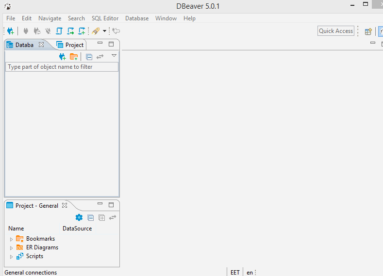

# Database Management

## What's the used database?

We use **PostgreSQL** since it has greater support with Django.

## Getting into the database container

To perform any operation on the database, you would need to get inside the postgres container

```
docker exec -it $(docker ps -a | grep db- | awk '{print $1}') /bin/sh
psql dorm_db -U dorm_user
```

## Backup Database

Inside the postgres container you simply run `pg_dump` like this

```
docker exec -it $(docker ps -a | grep db- | awk '{print $1}') /bin/sh
pg_dump -U dorm_user -Fc dorm_db > /var/lib/postgresql/data/my_backup.dump
```

* Do NOT forget to use your db credentials in the command above

Then copy the file to your local machine via `scp` ([Secure File Copy](https://www.ssh.com/ssh/scp/))

```
scp -i ssh_key.pem user@yourserver.domain.com:/var/dormportal/db/my_backup.dump .
```

## Restore Database

First copy the dumb into the server

```
scp -i ssh_key.pem ./my_backup.dump user@yourserver.domain.com:/home/user/my_backup.dump
```

* Do NOT forget to change `/home/user/` into your server username

Then get into the server via ssh

```
ssh -i ssh_key.pem user@yourserver.domain.com
```

And restore the db

```
sudo -i
cp /home/user/my_backup.dump /var/dormportal/db/my_backup.dump

docker exec -it $(docker ps -a | grep db | awk '{print $1}') /bin/sh

dropdb -U dorm_user dorm_db
createdb -U dorm_user dorm_db --template=template0 --owner=dorm_user
pg_restore -U dorm_user -d dorm_db --clean /var/lib/postgresql/data/my_backup.dump
```


### Backup Photos

Dormitory photos are located in `/var/dormportal/media` folder, you can copy it locally using scp

```
mkdir ./media
scp -r -i ssh_key.pem user@dorm.mydomain.com:/var/dormportal/media ./media
```

## Database Migrations

Doing migrations is the responsbility of the Django app, so you need to enter the Django app container first, then apply migrations

```
docker exec -it $(docker ps -a | grep api | awk '{print $1}') /bin/sh
python manage.py migrate
```

## Connecting to Database using DBeaver

In some scenarios, you might need to connect to the db using a SQL client, such as DBeaver, and perform SQL queries on it

The first thing you will need is to **allow inbound rules** for `port 5432`

* Do NOT forget to close that port after you finish as it exposes your database to the internet.

Then connect to your database as shown below



Now, you can perform any queries on the database.
