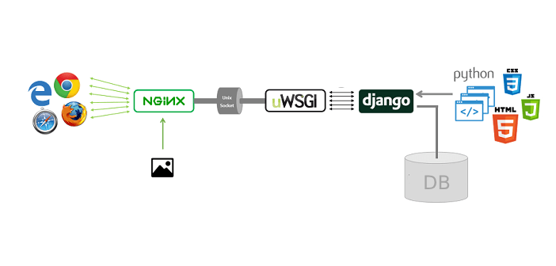

# Deploying the System

## What folders should we have after the deployment?

Running `ls /var/dormportal` should give you:

```
app  db  media
```

* **app**: contains the dorm-portal system
* **db**: contains the database
* **media**: contains the uploaded photos to the system

## 1. Cloning

The dormitory system repository is located at: https://www.github.com/coretabs/dorm-portal

You can use `git clone` to download the repository:

```
git clone https://www.github.com/coretabs/dorm-portal /var/dormportal/app
```

You will need then to go into the clone repository directory:

```
cd /var/dormportal/app
```

## 2. Filling Environmental Variables

Environmental variables are used to configure the system before running it.

All environmental variables can be stored in two ways:

1. Inside the host machine (using export command).
2. In `.env` file.

We will use the second way for convince and to **ensure there will be no conflicts with the existing env vars** in the host machine.

To fill up your env vars, create a `.env` file using vim or nano:

```
vim /var/dormportal/app/.env
```

[Please have a look at this sample.env file to fill up your `.env`](https://github.com/coretabs/dorm-portal/blob/master/sample.env)

### System Environmental Variables

| Variable | Description |
| --- | --- |
| **Database secrets** |
| POSTGRES_DB | Name of the postgres database |
| POSTGRES_USER | postgres username |
| POSTGRES_PASSWORD | postgres password |
| **Django secrets** |
| SECRET_KEY | Django secret key ([click here for more info](https://docs.djangoproject.com/en/2.2/ref/settings/#secret-key)). Preferred key length: 50 |
| DATABASE_URL | Connection string to your database (should match with your POSTGRES_DB, POSTGRES_USER, and POSTGRES_PASSWORD env vars) |
| **API configurations** |
| HOST_ENV | Defining which settings to use, `production` is the one we need here |
| DEBUG | If this is `true`, API responses will include error details |
| BASE_URL | The url of our application |
| ALLOWED_HOSTS | The allowed hosts to run this application |
| **Engine settings** |
| IS_ALWAYS_REVIEWABLE | Allow reservations to be reviewable just after the reservation has been made (for development purposes) |
| LANGUAGES | The system languages |
| **Email settings** |
| DEFAULT_FROM_EMAIL | Email sender |
| EMAIL_HOST | SMTP server DNS |
| EMAIL_HOST_USER | SMTP username |
| EMAIL_HOST_PASSWORD | SMTP password |

### Changing environmental variables

After changing the `.env` file, you will just need to [rebuild the containers using docker-compose](./containers-management.md#rebuild-all-containers).

## 3. Configuring NGINX

Nginx is a web server which can also be used as a reverse proxy, load balancer, mail proxy and HTTP cache, [more on NGINX in this video.](https://www.youtube.com/watch?v=ng5DsxYp-Bk)


*Original picture: https://www.vndeveloper.com/django-behind-uwsgi-nginx-centos-7/*

We use it for two main purposes:

1. As a reverse proxy to the Django app.

2. Serve photos (since the Django app cannot handle huge load).

### HTTPS and WWW redirection

NGINX is configure to redirect to https and www domain in [`nginx.conf`](https://github.com/coretabs/dorm-portal/blob/master/nginx.conf) file

```
if ($host !~ ^www\.) {
    rewrite ^ https://www.$host$request_uri permanent;
}
```

By deleting these lines, you will be able to enter the app from http (not recommended).


You can use vim to edit the file

```
vim /var/dormportal/app/nginx.conf
```

## 4. Change API URL

The API URL which the frontend uses can be located in [`backend.js`](https://github.com/coretabs/dorm-portal/blob/master/src/backend.js)

```
baseURL: 'http://127.0.0.1:8000/api',
```

Change this into the domain name that you have (**use https if needed**), for example:

```
baseURL: 'http://dorm.mydomain.com/api',
```

You can use vim to edit the file

```
vim /var/dormportal/app/src/backend.js
```

## 5. Running the System

This command will let docker-compose build all containers at once

```
docker-compose up -d
```

## 6. Sanity Check

After running the containers, you can check the status of the containers by

```
docker ps
```

You should get

```
CONTAINER ID        IMAGE                 COMMAND                  CREATED             STATUS              PORTS                    NAMES
90d3db177ccd        nginx:1.15.3-alpine   "nginx -g 'daemon of…"   5 mins ago        5 mins ago         0.0.0.0:80->80/tcp       production_nginx
6f2da3fdeb18        app_api              "sh -c 'crond && gun…"   5 mins ago        5 mins ago         0.0.0.0:8000->8000/tcp   app_api_1
dc42ac4cd1d1        postgres              "docker-entrypoint.s…"   5 mins ago        5 mins ago         0.0.0.0:5432->5432/tcp   app_db_1
```

This means that you have the three required containers (postgres, nginx, and the app).

* You will need to open 80 port in your inbound rules (in your server security settings).

* In case there was a missing container, try to [rebuild it as explained here.](./containers-management.md#rebuild-a-specific-container)